# eyes

Point your phone camera at anything; frames land on disk for your terminal AI agent.

<p align="center">
  
</p>

No app, no App Store, no cloud storage, no third-party relay by default.
The phone side is a single self-contained web page — open it in Safari, tap
**SNAP** or toggle **Stream** (~2 fps, adjustable). Frames arrive on this
machine as plain JPEGs at a stable path, replaced atomically.

## Why this instead of X

* **Agent-agnostic by design.** The contract is a file path, not a
  protocol: any agent that can read `~/.local/state/eyes/latest.jpg` has
  eyes — Claude Code, aider, a cron job, `cat`. No MCP required. (An
  `eyes mcp` stdio server is included for MCP-only clients like Claude
  Desktop — see below.)
* **One Python file, zero pip dependencies.** `curl` it, `chmod +x`, done.
  Nothing to `pip install`, no venv, no node_modules.
* **The iOS camera problem, actually solved.** iOS Safari refuses
  `getUserMedia` on self-signed certs even after you tap through the
  warning. `eyes` ships its own tiny local CA and walks you through
  trusting it once (~60 seconds); after that the camera just works, and
  cert renewals on IP change are automatic.
* **Remote mode is end-to-end encrypted, not "trust the relay".** Frames
  are AES-256-GCM ciphertext in the browser before they leave the phone;
  the key rides in the URL fragment, which browsers never send over the
  network — Cloudflare relays bytes it cannot read.

## Quick start

```sh
eyes serve                  # LAN mode — nothing leaves your network
eyes latest                 # print the path of the newest frame
eyes wait                   # block until a NEW frame arrives, print its path
eyes gc                     # prune history, printing every file removed
```

Frames land in `~/.local/state/eyes/`:

* `latest.jpg` — always the newest frame, replaced **atomically**
  (`os.replace`), so a reader can never see a half-written file. Point your
  agent's image-reading tool here.
* `history/frame-<timestamp>.jpg` — rolling history, capped (500 frames /
  200 MB by default) so it cannot fill the disk. `latest.jpg` is a hardlink
  into the history, so each frame is stored once.

The agent loop is simply: *"take a photo of the TV"* → `eyes wait` →
read `~/.local/state/eyes/latest.jpg`.

## Requirements

Python 3.8+, the `openssl` binary, and system libcrypto (present on
essentially every Linux). Remote mode additionally uses
[`cloudflared`](https://github.com/cloudflare/cloudflared) (see below).
If `qrencode` happens to be installed, `eyes serve` prints the URL as a
terminal QR code; otherwise you type the URL once and add it to the phone's
Home Screen — it stays stable across restarts.

## LAN mode — the iOS certificate dance (one-time, ~60 seconds)

`getUserMedia` (camera access) only works in a *secure context*. On iOS
Safari that is stricter than elsewhere: **a self-signed certificate is not
enough even after tapping through the warning** — Safari simply does not
expose `navigator.mediaDevices` on a page whose certificate it does not
fully trust. (Chrome lets you bypass this; iOS Safari does not.)

So `eyes` generates its own tiny certificate authority, once, in
`~/.local/state/eyes/`, and issues the HTTPS server certificate from it.
You trust that CA on the phone one time:

1. Run `eyes serve`, open the printed URL in Safari. You'll get
   *"This Connection Is Not Private"* — tap **Show Details → visit this
   website**. (This is expected exactly once, before the CA is trusted.)
2. The page detects that the camera API is unavailable and shows the
   install flow. Tap **Download certificate**, then **Allow**.
3. iOS Settings → **Profile Downloaded** → **Install**.
4. Settings → **General → About → Certificate Trust Settings** → turn ON
   **eyes local CA**.
5. Back to Safari, reload. Green context, camera works. Add to Home Screen.

When your machine's LAN IP changes, `eyes` re-issues the server certificate
under the same CA automatically — no re-trusting on the phone.

The CA lives only on this machine, its key only ever signs certificates for
this tool, and nothing is ever installed system-wide here (no sudo,
nothing under `/etc`).

## Remote mode — your own domain, end-to-end encrypted (opt-in)

LAN mode is the default and remote access never turns on by accident.
When you do want eyes away from home:

```sh
cloudflared tunnel login            # one browser click, once
eyes tunnel setup eyes.example.dev  # creates tunnel + DNS + user systemd unit
eyes tunnel up                      # start (systemctl --user)
eyes serve --remote
eyes tunnel down                    # kill remote access instantly
```

This uses a Cloudflare Tunnel: an *outbound-only* connection from this
machine, so no port forwarding, no firewall holes, no exposed home IP —
and the phone gets a real, publicly trusted certificate, so none of the
iOS certificate dance is needed remotely.

**The catch, handled:** Cloudflare terminates TLS at its edge, so a naive
setup would let Cloudflare see your camera frames. `eyes` therefore
encrypts every frame **in the browser** (WebCrypto AES-256-GCM, fresh
random 96-bit IV per frame) before it is sent. The key travels in the URL
**fragment** (`…/#k=<key>`) — browsers never send the fragment over the
network, so the key never reaches Cloudflare or any other intermediary.
The server decrypts locally and writes plain JPEGs to disk. In
`--remote` mode the server **refuses plaintext frames outright**, drops
(and loudly logs) anything that fails authentication/decryption, and
disables the `latest.jpg` viewing endpoint so plaintext never transits the
edge in either direction.

**Put Cloudflare Access in front (strongly recommended).** Free tier, and
it means a stranger who finds the hostname hits a login wall before a
single byte reaches your machine: Cloudflare dashboard → **Zero Trust →
Access → Applications → Add an application → Self-hosted**, set the domain
to your `eyes` hostname, add an *Allow* policy with *Include → Emails →
your email*, and enable the **One-time PIN** login method. On the phone
you'll enter a PIN emailed to you once per session duration; everything
else is unchanged. (`eyes tunnel setup` prints this reminder — it needs a
dashboard visit, there is no good non-interactive path on the free tier.)

### Installing cloudflared (no sudo)

Download the official static binary release and **verify the checksum**
against the one published in the release notes before installing:

```sh
V=$(curl -sI https://github.com/cloudflare/cloudflared/releases/latest | grep -i location | grep -o '[^/]*$' | tr -d '\r')
curl -sLO https://github.com/cloudflare/cloudflared/releases/download/$V/cloudflared-linux-amd64
curl -sL https://api.github.com/repos/cloudflare/cloudflared/releases/latest | grep -A40 'SHA256' | grep linux-amd64
sha256sum cloudflared-linux-amd64      # must match the line above
install -m 755 cloudflared-linux-amd64 ~/.local/bin/cloudflared
```

The tunnel runs as a **user** systemd unit (`systemctl --user`), created by
`eyes tunnel setup`, not enabled at boot: it runs only between
`eyes tunnel up` and `eyes tunnel down`.

## Threat model — honestly

Layers, outermost first:

1. **Network position.** LAN mode binds the LAN interface only (never
   `0.0.0.0`, and it refuses to bind non-private addresses). Remote mode is
   an outbound tunnel; nothing listens on the internet from your machine.
2. **Cloudflare Access** (remote, if you set it up): auth wall before
   anything reaches you.
3. **URL token.** Every path requires an unguessable token
   (`secrets.token_urlsafe`), compared in constant time. Without it:
   uniform 404.
4. **E2E key** (remote): frames are AES-256-GCM ciphertext to everyone but
   the phone page and this machine.
5. **Input hygiene:** 10 MB upload cap, global 8-frames/sec rate limit,
   payload must be a well-formed encrypted frame or (LAN only) start like a
   JPEG, history capped so disk can't fill.

What each party can see / do:

* **Anyone on your LAN** without the token: that a TLS server exists on
  that port. With the token (i.e. they saw the URL over your shoulder or in
  your shell history): they can view the latest frame and post frames.
  Rotate with `eyes serve --fresh-token`.
* **Cloudflare** (remote mode): that your machine keeps a tunnel open, the
  hostname, request timing/sizes, and the URL *path* (including the token —
  which is fine, the token's job is keeping strangers out and Cloudflare is
  already in front of it). It relays only AES-GCM ciphertext for frames; it
  never sees the key (fragment) or a single decrypted pixel. Metadata
  (when/how often you stream) is visible to it; content is not.
* **If the full URL including `#k=` leaks** (screenshot, shared link):
  the holder still has to get past Cloudflare Access (if configured), but
  assume compromise: delete `~/.local/state/eyes/e2e.key` and run
  `eyes serve --remote` again (new key), and `eyes serve --fresh-token`.
  Nuclear option: `eyes tunnel down` (instant), or delete the tunnel with
  `cloudflared tunnel delete eyes`.
* **This machine** holds everything: keys, CA, frames. That's the point —
  sovereign to you. Protect it like you already do.

Known caveats, stated plainly:

* The LAN hop from `cloudflared` to the local server uses the local CA cert
  with verification off (`noTLSVerify`) — both processes are on the same
  machine, so this hop never crosses a wire.
* iOS Safari must keep the page open while streaming; `eyes` takes a screen
  wake lock, but iOS will still pause captures if you switch apps. That is
  an iOS platform limit, not a bug here.
* Frame timestamps use the server's clock, not the phone's.

## For the agent

```sh
eyes latest        # -> /home/you/.local/state/eyes/latest.jpg (exit 1 if none)
eyes wait          # blocks until the human takes the next photo, prints path
eyes wait --timeout 120
eyes gc --keep 50  # prints every removed file before removing it
```

## MCP (optional)

The file path is the primary interface and always will be. But some
clients (Claude Desktop, for one) can *only* talk to tools over MCP, so
`eyes mcp` runs a minimal MCP server on stdio — same single file, still
zero dependencies. Register it:

```sh
claude mcp add -s user eyes -- /path/to/eyes mcp
```

(or point any MCP client's stdio config at `/path/to/eyes mcp`.)

Two tools:

* `eyes_latest` — returns the newest frame as an image, or an error if
  none has been captured yet.
* `eyes_wait` — blocks until the human captures a **new** frame, then
  returns it (`timeout_secs`, default 120).

`eyes serve` still does the capturing; `eyes mcp` only reads what it wrote
to disk. If your agent can read files, you don't need this.

## Tests

`python3 test_eyes.py` — 42 headless checks against a throwaway state dir:
the AES-256-GCM binding against a published test vector, WebCrypto interop
(Node encrypts exactly as the phone page does, Python decrypts), token /
size / rate-limit / plaintext-refusal rejections, atomicity of `latest.jpg`
under concurrent reads, the CLI, and the MCP stdio server. What it
*cannot* cover: a physical iPhone and a live tunnel.

## License

MIT.
